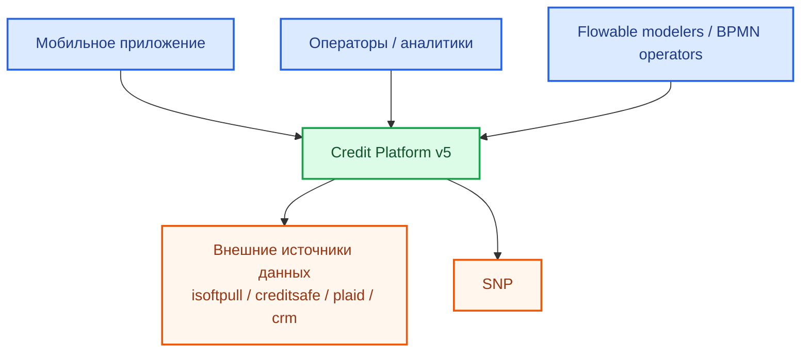
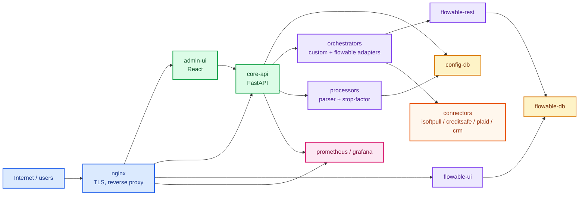
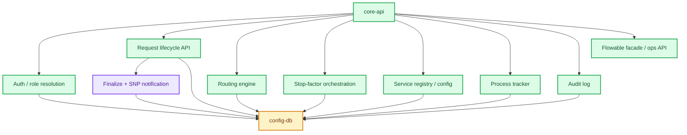
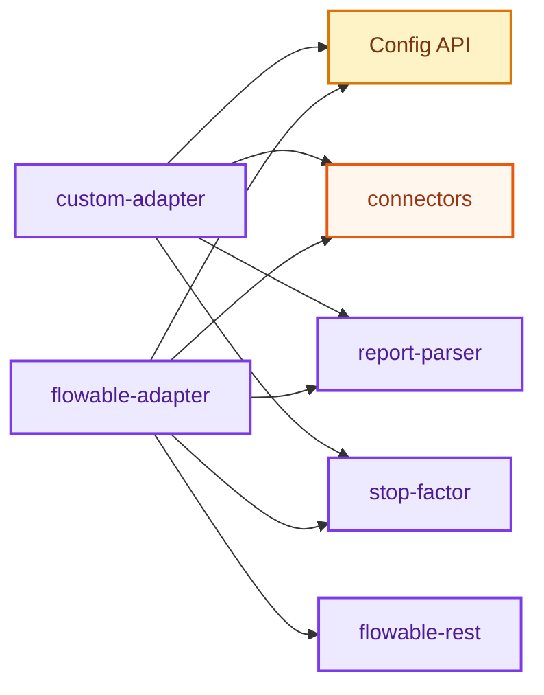
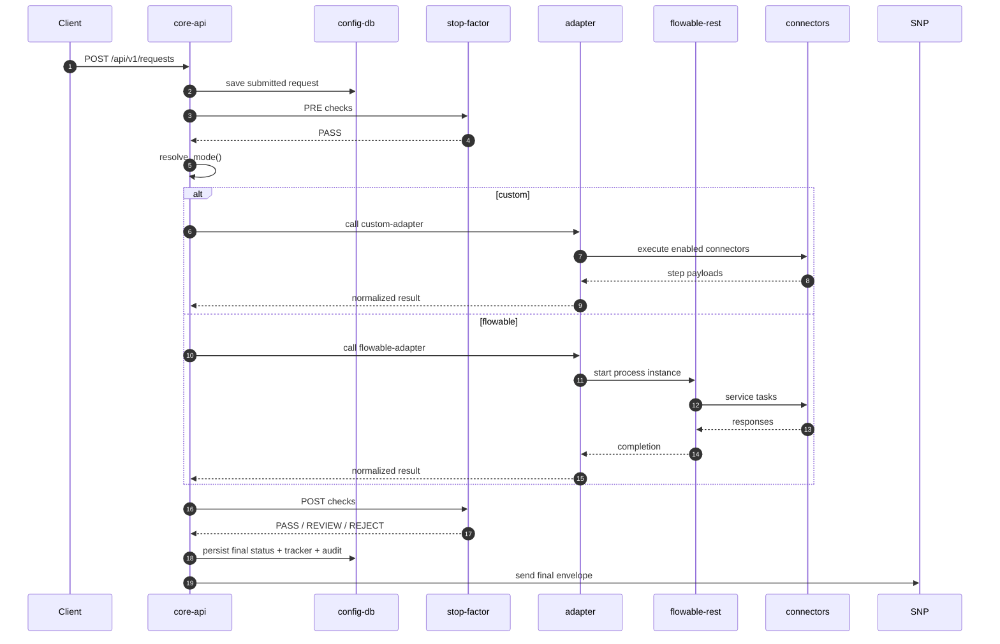
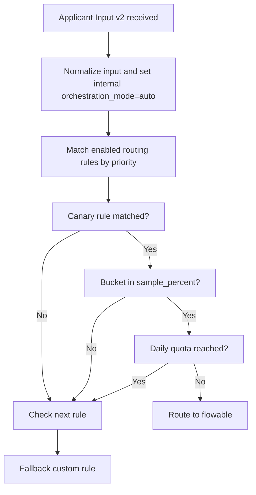

# Credit Platform v5: C4-style архитектура

## Назначение

Этот документ описывает архитектуру платформы в формате `C4`:

- `C1` System Context
- `C2` Container
- `C3` Component
- `C4` Dynamic / Runtime view

Документ полезен для:

- техлидов
- backend / frontend engineers
- DevOps
- архитектурного review

## C1. System Context

### Цель уровня

Показать систему как единый продукт в окружении пользователей и внешних систем.



### Смысл

Система выступает как единая orchestration-платформа между:

- внешними клиентами и операторами
- внутренними правилами принятия решений
- внешними сервисами и downstream-системами

## C2. Container View

### Цель уровня

Показать основные runtime-контейнеры, их ответственность и связи.



### Контейнеры

| Container | Технология | Ответственность |
| --- | --- | --- |
| `nginx` | nginx | TLS, public routing, reverse proxy |
| `admin-ui` | React / Vite | операторский UI |
| `core-api` | FastAPI | заявки, конфиг, routing, audit, auth |
| `orchestrators` | FastAPI services | custom и flowable execution adapters |
| `processors` | FastAPI services | report parser и stop-factor processor |
| `flowable-rest` | Flowable | BPMN runtime engine |
| `flowable-ui` | Flowable UI | modeler / admin / IDM |
| `config-db` | PostgreSQL | бизнес-конфиг и runtime data платформы |
| `flowable-db` | PostgreSQL | engine state и BPMN source of truth |
| `connectors` | FastAPI mocks / integrations | внешние данные и бюро |
| `prometheus/grafana` | OSS stack | наблюдаемость |

## C3. Component View: `core-api`

### Цель уровня

Показать внутренние доменные компоненты главного API.



### Компоненты `core-api`

| Компонент | Ответственность |
| --- | --- |
| `Auth` | UI login, session tokens, role resolution |
| `Requests API` | create/list/detail requests |
| `Routing engine` | `auto -> custom/flowable`, canary, daily quota |
| `Stop-factor orchestration` | pre/post business checks |
| `Service registry` | source of runtime endpoints |
| `Process tracker` | runtime trace for each request |
| `Audit log` | config and operator action history |
| `Flowable facade` | safe UI access to Flowable runtime |
| `Finalize + SNP` | final status, post-stop-factor, outbound SNP |

## C3. Component View: `orchestrators`

### Цель уровня

Показать, как устроен runtime execution layer.



### Компоненты execution layer

| Компонент | Ответственность |
| --- | --- |
| `custom-adapter` | sequential / configured execution of connector chain |
| `flowable-adapter` | start BPMN instance and normalize result back to platform |
| `report-parser` | produce `parsed_report` from raw step data |
| `stop-factor processor` | evaluate business rules |

## C4. Dynamic View: основной happy-path

### Цель уровня

Показать основную динамику обработки заявки.



## C4. Dynamic View: canary routing

### Цель уровня

Показать, как работает canary с quota.



## Deployment view

### Dev / local

- host ports открыты наружу
- удобно для локальной разработки и ручного тестирования

### Production

- публично exposed только `80/443`
- `nginx` публикует:
  - `admin-ui`
  - `core-api`
  - `flowable-ui`
  - `grafana`
- internal runtime остается внутри docker networks

## Архитектурные решения

### 1. UI не ходит в Flowable REST напрямую

Решение:

- `admin-ui -> core-api -> flowable-rest`

Причина:

- секреты остаются на сервере
- есть whitelist действий
- есть единый audit
- UI получает нормализованный ответ

### 2. BPMN source of truth может быть в Flowable

Если:

```text
FLOWABLE_AUTO_DEPLOY_BPMN=false
```

то production-источник истины для BPMN находится в `flowable-db`.

### 3. Routing отделён от execution

`core-api` выбирает путь, а adapters исполняют маршрут.

Это позволяет:

- безопасно переключать сценарии
- делать canary rollout
- не связывать всю платформу с одним execution engine

## Риски и ограничения

### Текущие ограничения

- fallback при отсутствии matching rules = `flowable`
- `daily quota` считается по UTC
- SNP сейчас best-effort без встроенного retry queue
- async completion Flowable по-прежнему adapter-driven, а не через отдельный durable worker

### Основные точки внимания

- порядок и `priority` routing rules
- согласованность service registry и orchestration runtime
- версионирование BPMN при редактировании через Flowable UI

## Когда использовать этот документ

Использовать `ARCHITECTURE_C4_RU.md`, когда нужен:

- архитектурный review
- onboarding инженеров
- техдизайн обсуждение
- подготовка к Confluence / ADR / design review
