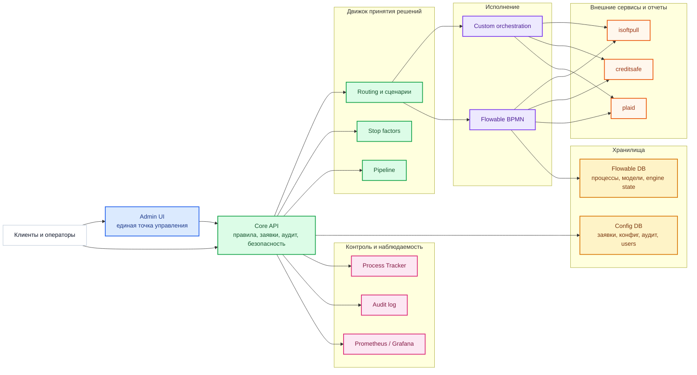

# Credit Platform v5: Архитектура для руководства

## Назначение

Эта схема показывает платформу на уровне управленческого обзора:

- где находится точка входа
- какие основные домены системы существуют
- где принимаются решения
- где хранится состояние
- как организован контроль и наблюдаемость

## Executive view

## Что важно для руководства

### 1. Платформа разделена на два независимых маршрута исполнения

- `custom`
  быстрый управляемый маршрут для прикладной логики и интеграций
- `flowable`
  BPMN-маршрут для визуального моделирования и контроля бизнес-процессов

Это позволяет:

- гибко переключать трафик
- вводить canary rollout
- безопасно тестировать новые процессы

### 2. Вся критичная конфигурация управляется централизованно

Через `Admin UI` можно менять:

- routing
- сценарии работы
- stop factors
- pipeline
- сервисы
- пользователей и доступы

### 3. Система разделяет бизнес-логику и исполнение

`Core API` принимает решение, какой путь выбрать, а `custom` и `flowable` уже исполняют маршрут.

Это снижает зависимость платформы от одного движка и дает гибкость эксплуатации.

### 4. Есть полный контур контроля

- `Process Tracker`
  показывает, как прошла конкретная заявка
- `Audit log`
  показывает, кто и что менял
- `Prometheus / Grafana`
  показывают техническое состояние платформы

## Бизнес-ценность

Платформа дает компании:

- быстрый ввод новых маршрутов проверки
- снижение операционного риска при изменениях
- контроль над canary rollout
- прозрачность заявок и решений
- готовый operational UI без ручного shell-управления

## Ключевые управленческие сценарии

Через UI можно:

1. Перевести весь auto-трафик в `custom`
2. Запустить Flowable только на доле трафика
3. Ограничить Flowable по дневному лимиту
4. Отключить блокирующие stop factors
5. Отключить проблемный интеграционный сервис

## Ключевые риски и как они закрыты

### Риск: изменение процесса ломает поток заявок

Снижается за счет:

- canary rollout
- fallback на `custom`
- UI-сценариев

### Риск: непрозрачность причин отказа или сбоя

Снижается за счет:

- request tracker
- audit log
- flowable ops

### Риск: ручные изменения в production

Снижается за счет:

- централизованного Admin UI
- сценариев `Scenarios`
- production deployment scripts
