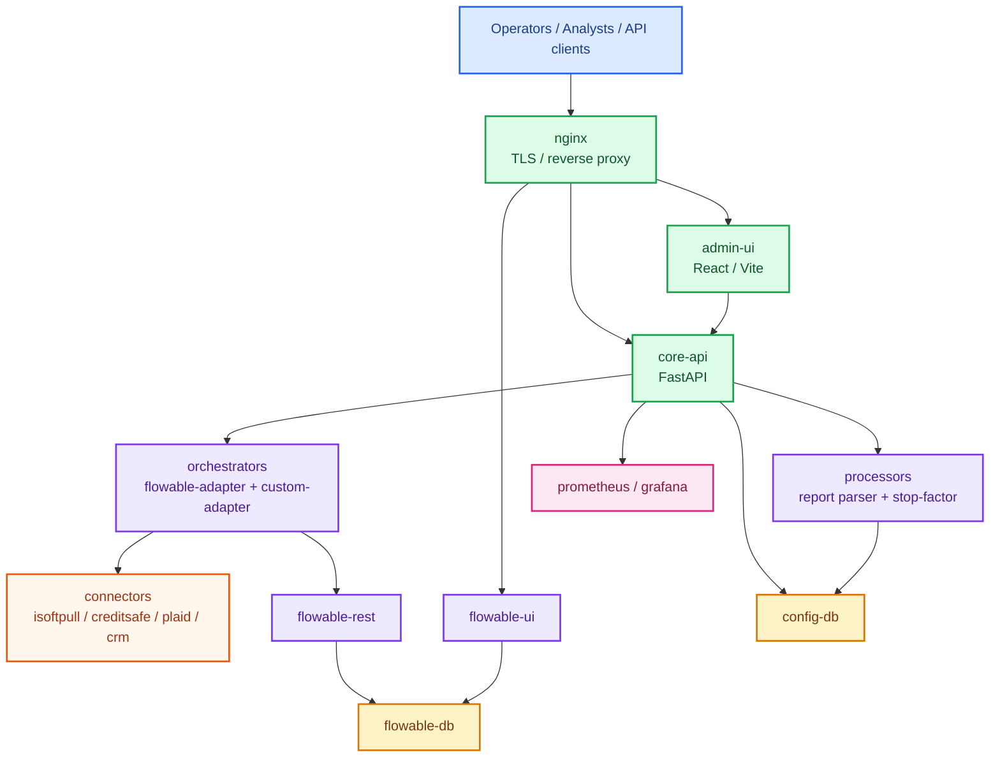
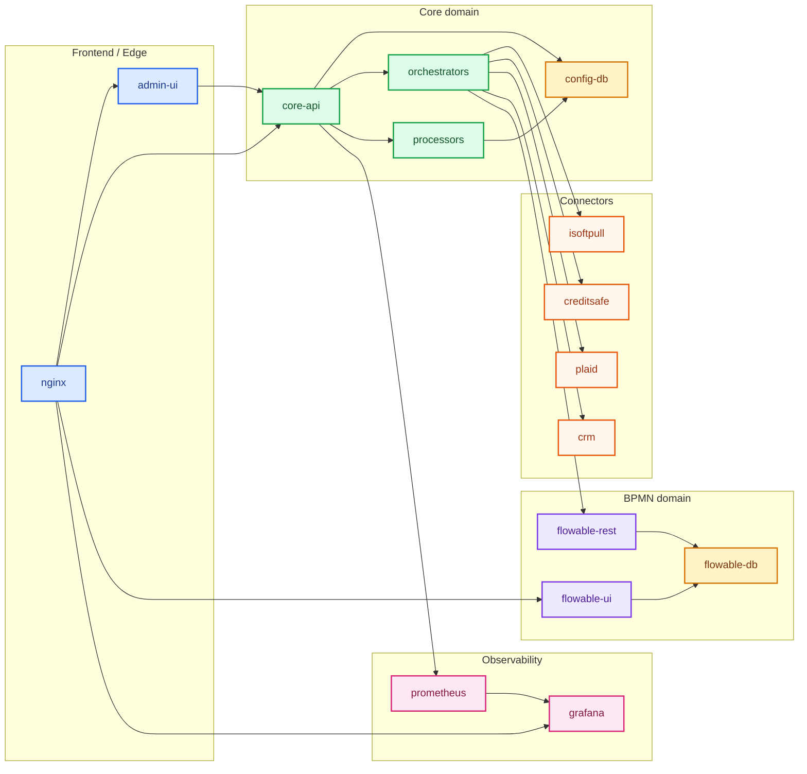
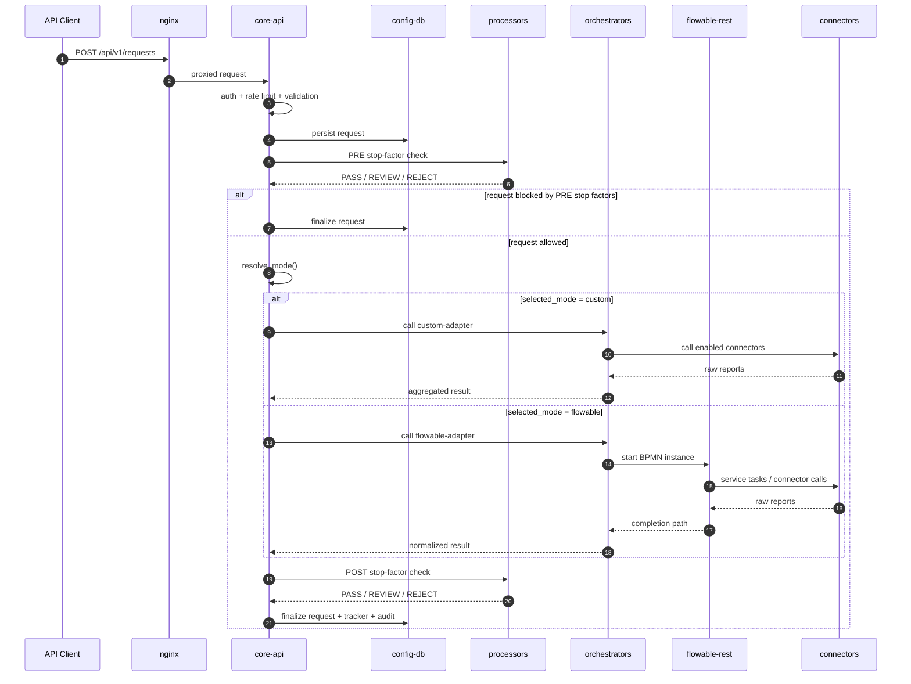
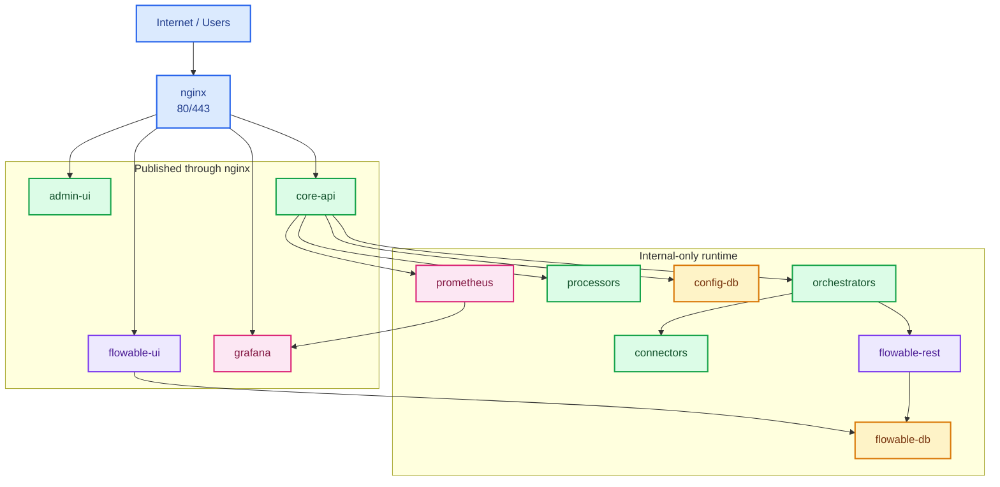

# Credit Platform v5: Техническая архитектура для команды и разработчиков

## Назначение

Этот документ описывает архитектуру платформы на техническом уровне:

- контейнеры и домены
- сетевую схему
- request lifecycle
- ownership данных
- configuration flow
- production topology

Документ предназначен для:

- backend engineers
- frontend engineers
- DevOps
- senior analysts
- технических лидов

## 1. Контекстная схема



## 2. Контейнерная архитектура



## 3. Сетевые домены

По compose-конфигурации используются сети:

- `frontend`
  edge и UI-доступ
- `backend`
  `core-api`, orchestrators, processors, connectors
- `db`
  `config-db`
- `flowable`
  `flowable-rest`, `flowable-ui`, `flowable-db`, `orchestrators`, `nginx`
- `monitoring`
  `prometheus`, `grafana`

### Практический смысл

- `nginx` имеет доступ к `frontend` и `flowable`
- `core-api` не должен ходить напрямую в `flowable-ui`
- `orchestrators` связывают `backend` и `flowable`
- `config-db` и `flowable-db` разделены намеренно

## 4. Ownership данных

| Домен данных | Источник истины | Где используется |
| --- | --- | --- |
| Заявки | `config-db` | `core-api`, UI, tracker |
| Routing rules | `config-db` | `core-api`, UI |
| Pipeline steps | `config-db` | `core-api`, UI, orchestrators |
| Stop factors | `config-db` | `core-api`, processors, UI |
| Services registry | `config-db` | `core-api`, orchestrators, UI |
| Admin users / sessions | `config-db` | `core-api`, UI |
| Audit log | `config-db` | `core-api`, UI |
| Request tracker events | `config-db` | `core-api`, UI |
| BPMN models | `flowable-db` при `FLOWABLE_AUTO_DEPLOY_BPMN=false` | Flowable UI / engine |
| Runtime process state | `flowable-db` | Flowable engine |

## 5. Жизненный цикл заявки



## 6. Routing engine

Routing logic находится в `core-api/coreapi/services.py`.

### Алгоритм

Перед routing внешняя заявка нормализуется во внутреннюю модель. Для внешнего контракта `Applicant Input v2` поле `orchestration_mode` клиентом не передается, и платформа выставляет внутреннее значение `auto`.

1. Если во внутренней модели `orchestration_mode` уже не `auto`, вернуть заданный режим
2. Итерировать `enabled` rules по `priority`
3. Проверить:
   - condition match
   - canary match
   - daily quota match
4. Вернуть первый `target_mode`
5. Если ничего не подошло, fallback = `flowable`

### Поля routing rule

- `name`
- `priority`
- `condition_field`
- `condition_op`
- `condition_value`
- `target_mode`
- `enabled`
- `meta`

### `meta` для canary

- `sample_percent`
  доля трафика, идущая в rule
- `sticky_field`
  поле для детерминированного bucket selection
- `daily_quota_enabled`
  включает дневной лимит
- `daily_quota_max`
  максимум заявок в день для данного rule

### Важно

`daily_quota` сейчас считается по UTC-суткам.

## 7. UI control plane

### `Scenarios`

Страница `Scenarios` является операторским UI-слоем поверх:

- `routing_rules`
- `pipeline_steps`
- `stop_factors`
- `services`

Она не вводит новую бизнес-сущность, а управляет уже существующими конфигурациями согласованным способом.

### Что можно делать через `Scenarios`

- перевести весь auto-трафик в `custom`
- подготовить custom reports chain
- настроить Flowable canary
- отключить все stop factors

### Flowable canary block

Содержит:

- `Percent`
- `Sticky field`
- `Enabled`
- `Daily quota mode`
- `Max requests per day`
- `Apply`

## 8. Pipeline behavior

Pipeline steps хранятся в БД и читаются orchestrator-ами через config API.

Поддерживаются:

- `enabled`
- `skip_in_custom`
- `skip_in_flowable`

### Runtime semantics

- если step выключен для текущего режима, он логируется как `SKIPPED`
- если service отключен в registry, orchestrator не вызывает его и пишет `SKIPPED`

## 9. Services registry

Services registry определяет runtime endpoint-ы для:

- connectors
- engine
- adapters
- processors

Основные поля:

- `id`
- `type`
- `base_url`
- `endpoint_path`
- `timeout_ms`
- `retry_count`
- `enabled`

## 10. Flowable integration model

### Best practice

UI не ходит в Flowable REST напрямую.

Схема:

```text
Admin UI -> core-api -> Flowable REST
```

### Почему

- креды Flowable остаются на сервере
- есть whitelist доступных действий
- есть audit
- UI работает с нормализованной моделью

### Production modeling mode

Если `FLOWABLE_AUTO_DEPLOY_BPMN=false`:

- Flowable UI и Flowable DB становятся source of truth для BPMN
- изменения модели сохраняются внутри Flowable
- file-based auto-deploy не должен перезаписывать production model

## 11. Request tracking and audit

### Request tracker

Хранит:

- входы и выходы по шагам
- статусы сервисов
- payload snippets
- состояние заявки

### Audit log

Хранит:

- entity
- action
- actor context
- payload change
- timestamp

### Разделение

- tracker = business/runtime trace
- audit = configuration and operator actions

## 12. Production topology



## 13. Deployment and operations

### One-command bootstrap

```bash
DOMAIN=your-domain.com bash scripts/deploy-prod.sh
```

### Reset only Flowable

```bash
bash scripts/reset-flowable.sh
```

### Full production rebuild

```bash
bash scripts/rebuild-prod.sh
```

## 14. Main operational failure modes

### 1. Requests go to wrong mode

Проверять:

- `routing_rules`
- priorities
- enabled flags
- canary percent
- daily quota state
- orchestrator config cache

### 2. Flowable UI unavailable

Проверять:

- `flowable-db`
- `flowable-rest`
- `flowable-ui`
- `nginx`
- `FLOWABLE_DB_PASSWORD`

### 3. UI shows stale behavior

Проверять:

- актуальный frontend bundle
- hard refresh / incognito
- actual `core-api` build on server

### 4. Service disabled but still called

Проверять:

- registry `enabled`
- orchestrator build version
- config cache refresh window

## 15. Recommended future improvements

- business timezone-aware daily quota
- draft/publish for routing and pipeline configs
- explicit rollback snapshots for scenarios
- OpenTelemetry propagation across core-api, adapters, processors, connectors
- durable worker instead of in-process async watcher for Flowable completion
