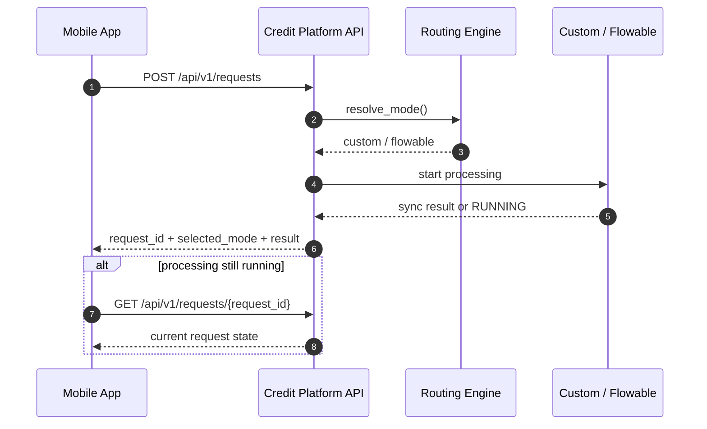

# Credit Platform v5: ТЗ на интеграцию с мобильным приложением

## 1. Назначение

Этот документ описывает интеграцию мобильного приложения с платформой Credit Platform v5.

Документ определяет:

- целевой сценарий взаимодействия
- API-контракты
- требования к безопасности
- требования к обработке ошибок
- нефункциональные требования
- критерии приемки

## 2. Цель интеграции

Мобильное приложение должно уметь:

1. отправлять заявку на кредитную проверку
2. получать результат обработки заявки
3. отображать итоговый статус пользователю

Интеграция не предполагает прямой работы мобильного приложения с:

- `admin-ui`
- `flowable-rest`
- `flowable-ui`
- внутренними service endpoint-ами платформы

Единственная внешняя интеграционная точка для мобильного приложения:

- `core-api`

## 3. Общая схема интеграции



## 4. Интеграционный контур

### 4.1 Базовый URL

Production:

```text
https://YOUR_DOMAIN
```

Пример:

```text
https://65.109.174.58
```

### 4.2 Основные endpoints

- `POST /api/v1/requests`
  создать заявку
- `GET /api/v1/requests/{request_id}`
  получить карточку заявки
- `GET /api/v1/requests`
  получить список заявок

Опционально для расширенной диагностики:

- `GET /api/v1/requests/{request_id}/tracker`

## 5. Безопасность

### 5.1 Аутентификация

Мобильное приложение должно использовать gateway key:

```http
X-Api-Key: <GATEWAY_API_KEY>
```

### 5.2 Важно

Мобильное приложение не должно использовать:

- `ADMIN_API_KEY`
- `SENIOR_ANALYST_API_KEY`
- `ANALYST_API_KEY`
- `INTERNAL_API_KEY`

### 5.3 Рекомендация

Gateway key не должен храниться открыто внутри мобильного клиента.

Рекомендуемый production-паттерн:

- мобильное приложение вызывает backend mobile gateway / BFF
- BFF уже вызывает Credit Platform API

Если интеграция все же идет напрямую:

- ключ должен передаваться только по HTTPS
- сборки mobile app должны быть защищены от утечки секрета

## 6. Контракт создания заявки

### 6.1 Endpoint

```http
POST /api/v1/requests
```

### 6.2 Headers

```http
Content-Type: application/json
X-Api-Key: <GATEWAY_API_KEY>
```

### 6.3 Request body

```json
{
  "request_id": "REQ-2026-0001",
  "customer_id": "CUST-001",
  "iin": "900101123456",
  "product_type": "loan",
  "orchestration_mode": "auto",
  "payload": {
    "amount": 5000,
    "currency": "USD",
    "term_months": 12
  }
}
```

### 6.4 Поля

| Поле | Обязательность | Описание |
| --- | --- | --- |
| `request_id` | обязательно | уникальный идентификатор заявки на стороне интегратора |
| `customer_id` | обязательно | идентификатор клиента |
| `iin` | обязательно | ИИН клиента |
| `product_type` | обязательно | тип продукта, например `loan` |
| `orchestration_mode` | обязательно | `auto`, `custom`, `flowable` |
| `payload` | обязательно | дополнительные бизнес-поля заявки |

### 6.5 Требования к `request_id`

`request_id` должен быть:

- уникальным
- стабильным
- пригодным для повторного поиска и корреляции

Если отправить уже существующий `request_id`, API вернет `409 Conflict`.

## 7. Ответ на создание заявки

### 7.1 Успешный ответ

```json
{
  "request_id": "REQ-2026-0001",
  "selected_mode": "flowable",
  "result": {
    "status": "RUNNING",
    "adapter": "flowable",
    "request_id": "REQ-2026-0001",
    "engine": {
      "engine": "flowable",
      "started": true,
      "instance_id": "12345",
      "completed": false
    }
  }
}
```

### 7.2 Возможные варианты ответа

#### Сценарий A. Заявка завершилась синхронно

Мобильное приложение сразу получает финальный `result`.

#### Сценарий B. Заявка ушла в асинхронную обработку

Мобильное приложение получает:

- `selected_mode`
- промежуточный `result`
- статус `RUNNING`

После этого клиент должен опрашивать заявку через:

```http
GET /api/v1/requests/{request_id}
```

## 8. Получение статуса заявки

### 8.1 Endpoint

```http
GET /api/v1/requests/{request_id}
```

### 8.2 Headers

```http
X-Api-Key: <GATEWAY_API_KEY>
```

### 8.3 Ответ

API возвращает карточку заявки из БД, включая:

- `request_id`
- `customer_id`
- `product_type`
- `orchestration_mode`
- `status`
- `result`
- `post_stop_factor`
- `snp_result`
- timestamps

### 8.4 Рекомендованный polling

Если заявка вернулась со статусом `RUNNING`, мобильное приложение должно:

1. ждать 2-5 секунд
2. повторять запрос `GET /api/v1/requests/{request_id}`
3. останавливать polling после перехода в финальный статус

Финальные статусы:

- `COMPLETED`
- `REVIEW`
- `REJECTED`
- `FAILED`

## 9. Статусы и их смысл

| Статус | Смысл |
| --- | --- |
| `SUBMITTED` | заявка сохранена и отправлена в orchestration |
| `RUNNING` | обработка идет асинхронно |
| `COMPLETED` | обработка успешно завершена |
| `REVIEW` | заявка требует ручного рассмотрения |
| `REJECTED` | заявка отклонена |
| `FAILED` | техническая ошибка обработки |

## 10. Ошибки API

### 10.1 `401 Unauthorized`

Причина:

- неверный `X-Api-Key`

### 10.2 `409 Conflict`

Причина:

- повторно использован `request_id`

### 10.3 `429 Too Many Requests`

Причина:

- превышен rate limit

### 10.4 `502 Bad Gateway`

Причина:

- техническая ошибка в orchestration или недоступность зависимого сервиса

### 10.5 `503 Service Unavailable`

Причина:

- adapter не настроен или недоступен

## 11. Бизнес-ограничения

### 11.1 Режим `auto`

В режиме `auto` фактический путь заявки выбирается платформой по `routing_rules`.

То есть мобильное приложение не гарантирует, что заявка пойдет именно в:

- `custom`
- `flowable`

если явно не указать нужный режим.

### 11.2 Рекомендуемый режим для мобилки

Рекомендуется использовать:

```json
"orchestration_mode": "auto"
```

потому что это позволяет платформе самой:

- делать canary rollout
- менять routing без обновления мобильного клиента
- ограничивать долю Flowable

## 12. Нефункциональные требования

### 12.1 Производительность

- API должен отвечать на создание заявки в пределах SLA, согласованного с бизнесом
- при асинхронной обработке ответ должен возвращаться быстро, без ожидания полного завершения всей цепочки

### 12.2 Надежность

- мобильный клиент должен уметь повторно запрашивать статус по `request_id`
- дубликаты должны отсекаться по `request_id`

### 12.3 Безопасность

- только HTTPS
- gateway key не должен утекать в открытый код мобильного приложения

## 13. Рекомендованный UX для мобильного приложения

### При отправке

- показать пользователю "заявка отправлена"
- сохранить `request_id`

### Если `status=RUNNING`

- показать "идет обработка"
- запустить polling

### Если `status=REVIEW`

- показать "заявка отправлена на дополнительное рассмотрение"

### Если `status=REJECTED`

- показать отказ по правилам бизнеса

### Если `status=FAILED`

- показать техническую ошибку и предложить повторить позже

## 14. Критерии приемки

Интеграция считается принятой, если:

1. мобильное приложение успешно создает заявку через `POST /api/v1/requests`
2. при повторном `request_id` получает `409`
3. умеет читать статус через `GET /api/v1/requests/{request_id}`
4. корректно обрабатывает `RUNNING`
5. корректно отображает `COMPLETED / REVIEW / REJECTED / FAILED`
6. не использует admin/internal ключи

## 15. Минимальный тестовый сценарий

### Создание заявки

```bash
curl -k -X POST https://YOUR_DOMAIN/api/v1/requests \
  -H "Content-Type: application/json" \
  -H "X-Api-Key: YOUR_GATEWAY_API_KEY" \
  -d '{
    "request_id": "REQ-MOBILE-001",
    "customer_id": "CUST-001",
    "iin": "900101123456",
    "product_type": "loan",
    "orchestration_mode": "auto",
    "payload": {
      "amount": 5000,
      "currency": "USD",
      "term_months": 12
    }
  }'
```

### Получение статуса

```bash
curl -k https://YOUR_DOMAIN/api/v1/requests/REQ-MOBILE-001 \
  -H "X-Api-Key: YOUR_GATEWAY_API_KEY"
```

## 16. Рекомендации на следующий этап

- добавить отдельный client-facing callback, если мобильному приложению нужен push-канал вместо polling
- добавить отдельный mobile BFF вместо прямого хранения gateway key в приложении
- согласовать бизнес-словарь ошибок для отображения в UI
