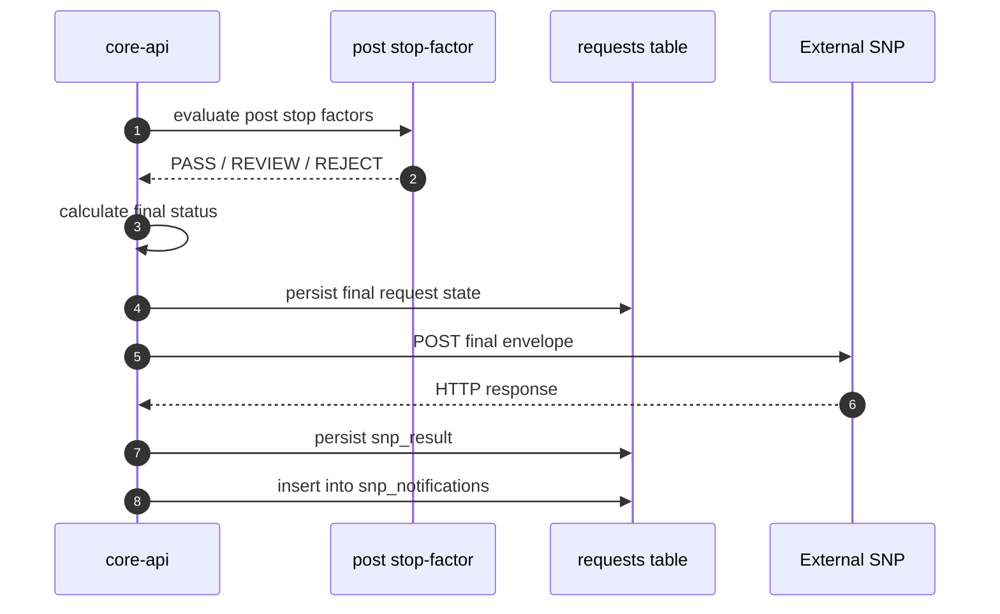

# Credit Platform v5: ТЗ на интеграцию с SNP в конце процесса

## 1. Назначение

Этот документ описывает outbound-интеграцию Credit Platform v5 с внешней системой `SNP`, которая вызывается после завершения обработки заявки.

Под "в конце" понимается:

- после завершения orchestration
- после post stop-factor проверки
- после вычисления финального статуса заявки

## 2. Цель интеграции

После финализации заявки платформа должна отправить в SNP итоговый envelope с результатом.

Интеграция нужна для:

- доставки финального статуса заявки
- доставки агрегированного результата
- доставки результата post stop-factor проверки
- фиксации факта уведомления downstream-системы

## 3. Точка вызова в жизненном цикле



## 4. Источник вызова

SNP уведомляется из `core-api`, функция:

- `notify_snp(...)`

Вызывается из:

- `finalize_request(...)`

Это означает, что SNP получает только финализированную заявку, а не промежуточный runtime-state.

## 5. Адрес SNP

Платформа ищет endpoint SNP в следующем порядке:

1. `SNP_EXTERNAL_URL` из environment
2. `services.id = 'snp-external'` в service registry

## 6. Контракт вызова SNP

### 6.1 Метод

```http
POST
```

### 6.2 Headers

На текущий момент платформа отправляет:

```http
Content-Type: application/json
X-Correlation-ID: <correlation-id>
```

### 6.3 Тело запроса

Фактический envelope на текущий момент выглядит так:

```json
{
  "request_id": "REQ-2026-0001",
  "status": "COMPLETED",
  "mode": "custom",
  "result": {
    "status": "COMPLETED",
    "adapter": "custom",
    "request_id": "REQ-2026-0001",
    "steps": {},
    "parsed_report": {}
  },
  "post_stop_factor": {
    "decision": "PASS",
    "reason": "all checks passed"
  }
}
```

## 7. Поля envelope

| Поле | Обязательность | Описание |
| --- | --- | --- |
| `request_id` | обязательно | идентификатор заявки |
| `status` | обязательно | финальный статус заявки |
| `mode` | обязательно | фактический путь orchestration: `custom` или `flowable` |
| `result` | обязательно | нормализованный итоговый payload заявки |
| `post_stop_factor` | обязательно | результат post stop-factor проверки |

## 8. Финальный статус заявки

В SNP должен уходить уже финальный статус, рассчитанный платформой:

- `COMPLETED`
- `REVIEW`
- `REJECTED`
- `FAILED`

Логика статуса:

1. берется `result.status`
2. если post stop-factor вернул `REJECT`, статус принудительно становится `REJECTED`
3. если post stop-factor вернул `REVIEW` и заявка была `COMPLETED`, статус становится `REVIEW`

## 9. Поведение при ошибках SNP

### 9.1 Если SNP недоступен

Платформа:

- не откатывает финализацию заявки
- не переводит заявку обратно в ошибку
- сохраняет информацию о неуспешной отправке в `snp_notifications`

### 9.2 Что считается успешной отправкой

Уведомление считается успешно forward-нутым, если HTTP status code `< 400`.

### 9.3 Что сохраняется

В таблицу `snp_notifications` сохраняются:

- `request_id`
- `snp_target`
- `forwarded`
- `response_code`
- `error`

В таблицу `requests` сохраняется:

- `snp_result`

## 10. Важное ограничение текущей реализации

На текущий момент интеграция SNP:

- не имеет встроенного retry-механизма
- не использует очередь
- не подписывает запросы отдельным auth header
- не делает idempotency handshake с SNP

То есть это "best effort synchronous outbound notification" в конце финализации.

## 11. Требования к SNP на стороне получателя

SNP должна:

1. принимать `POST` с JSON body
2. поддерживать `X-Correlation-ID`
3. возвращать корректный HTTP status
4. уметь обрабатывать повторную доставку на уровне идемпотентности, если такой механизм будет добавлен позже

## 12. Требования к SLA

### На стороне платформы

- timeout outbound-вызова SNP сейчас составляет `15s`

### На стороне SNP

Рекомендуется:

- отвечать быстро
- не удерживать соединение дольше SLA платформы
- при необходимости перенести тяжелую обработку внутрь собственной очереди SNP

## 13. Рекомендуемая contract model для SNP

Рекомендуется зафиксировать следующие бизнес-семантики:

### `status`

- `COMPLETED`
  заявка успешно завершена
- `REVIEW`
  заявка требует ручной проверки
- `REJECTED`
  заявка отклонена
- `FAILED`
  техническая ошибка обработки

### `mode`

- `custom`
  заявка обработана собственным adapter path
- `flowable`
  заявка обработана через BPMN Flowable

## 14. Требования к аудиту и трассировке

Каждое SNP уведомление должно быть связано с:

- `request_id`
- `correlation_id`

На стороне платформы оператор должен иметь возможность:

- увидеть факт отправки в `snp_notifications`
- понять, был ли forward успешен

## 15. Нефункциональные требования

### 15.1 Надежность

- failure SNP не должен ломать финализацию заявки
- информация о failed delivery должна сохраняться

### 15.2 Безопасность

Минимум:

- HTTPS между платформой и SNP

Желательно на следующем этапе:

- auth header
- mTLS или signed webhook
- allowlist источников

### 15.3 Наблюдаемость

Должна быть доступна диагностика:

- куда отправлялось
- какой был response code
- какая была ошибка

## 16. Критерии приемки

Интеграция считается принятой, если:

1. после финализации заявки SNP получает `POST`
2. SNP получает `request_id`, `status`, `mode`, `result`, `post_stop_factor`
3. при `2xx` уведомление помечается как `forwarded=true`
4. при ошибке SNP уведомление сохраняется в `snp_notifications`
5. ошибка SNP не отменяет финальный статус заявки

## 17. Тестовый сценарий

### Шаг 1. Настроить SNP endpoint

Вариант A:

```env
SNP_EXTERNAL_URL=https://snp.example.com/callback
```

Вариант B:

создать / обновить `services.id = snp-external`

### Шаг 2. Отправить тестовую заявку

```bash
curl -k -X POST https://YOUR_DOMAIN/api/v1/requests \
  -H "Content-Type: application/json" \
  -H "X-Api-Key: YOUR_GATEWAY_API_KEY" \
  -d '{
    "request_id": "REQ-SNP-001",
    "customer_id": "CUST-001",
    "iin": "900101123456",
    "product_type": "loan",
    "orchestration_mode": "auto",
    "payload": {
      "amount": 5000,
      "currency": "USD",
      "term_months": 12
    }
  }'
```

### Шаг 3. Проверить журнал SNP уведомлений

```bash
curl -k https://YOUR_DOMAIN/api/v1/snp-notifications \
  -H "X-Api-Key: YOUR_ADMIN_API_KEY" \
  -H "X-User-Role: admin"
```

## 18. Рекомендуемое развитие интеграции

Следующий этап для SNP:

1. добавить auth header для outbound SNP callback
2. добавить retry policy
3. добавить dead-letter / retry queue
4. добавить explicit delivery status в UI
5. сделать формальный versioned contract, например `v1`
